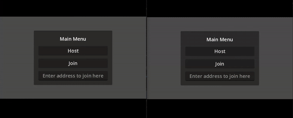

# flagoria
Flagoria - A Captivating Island Adventure!

Features:
- procedural generated tilemap
- multilayer setup with UPNP
- PVP (5s timeout to regen)

## Two-player play-test checklist

Use two instances on one machine. Empty join address means localhost.

1. **Host** — Instance A: Main Menu → Host. Confirm the world loads and a local player spawns.
2. **Join** — Instance B: Main Menu → Join (leave address empty for localhost, or enter the host address). Confirm the second player appears for both.
3. **Move** — Move both players with keyboard or on-screen joystick; each should see the other move.
4. **Attack** — Attack (space / attack button) near the other player; confirm hit / health change.
5. **Regen** — After taking damage, wait for the regen timer; confirm health recovers (unless at zero).

